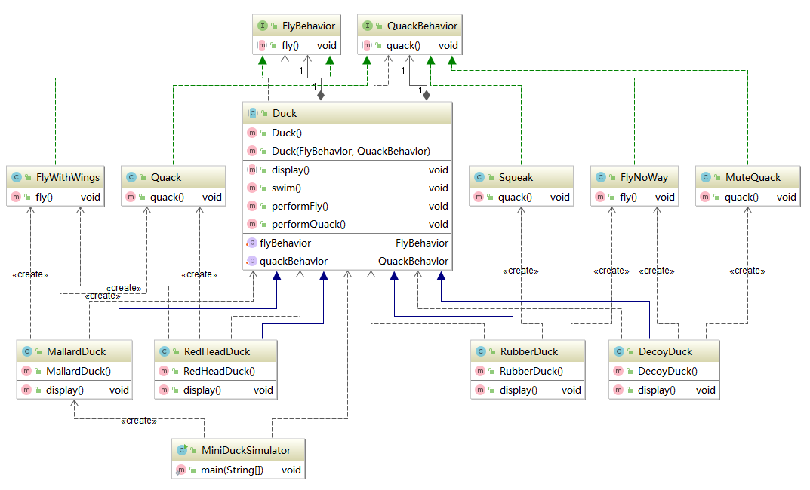
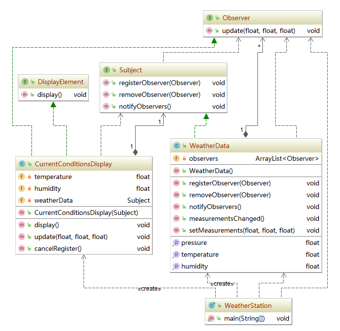

# Head First Design Pattern

* IDE: [Intellij IDEA](https://www.jetbrains.com/idea/) :green_heart:
* Building Tool: [Maven](http://maven.apache.org/) :purple_heart:

## 面向对象基础 :star:

* 抽象
  
* 封装
  
* 继承
  
* 多态

## 设计原则 :star2:

* 找出应用中可能需要变化之处，把它们独立出来，不要和那些不需要变化的代码混在一起。
  
* 针对接口编程，而不是针对实现编程。
  
* 多用组合，少用继承。
  
* 为了交互对象之间的松耦合设计而努力
  
*
  
*

## 策略模式 :duck:

* 定义：定义了算法族，分别封装起来，让它们之间可以互相替换，此模式让算法的变化独立于使用算法的客户。
  
* 代码解析：这里将变化的部分从系统种抽离出来，如飞和叫两种行为，因为不同的子类会有不同的实现，有的鸭子不会飞（如橡皮鸭）或者不会叫（如诱饵鸭），因此将飞的行为和叫的行为分离设计成两个接口，再针对接口进行不同的具体实现，在抽象类中我们通过组合的方式，针对抽象编程，将两种行为的接口作为数据域，在抽象类具体化的时候通过动态绑定到具体的行为的实现。
  
* UML类图：
  
  
  
* 用到的设计原则
  
  * 封装变化

  * 多用组合，少用继承

  * 针对接口编程，不针对实现编程

## 观察者模式 :cloud:

* 定义：定义了对象之间的一对多的依赖关系，这样一来，当一个对象改变状态时，它的所有依赖都会收到通知并自动更新。

* 代码解读： 首先我们因该将该系统的各个角色与观察者模式中的两大角色**主题**和**观察者**进行联系，在该气象站系统中，WeatherData就是充当了一个主题这样的角色，而公告板则是充当观察者角色。根据面向接口编程原则，我们新建一个Subject接口，在其中定义register、remove、notify方法，并用WeatherData具体的类实现这个接口，在该类中维持一组对观察者对象的引用。定义Observer接口和DisplayElement接口分别定义`update()`和`display()`方法，再用具体的观察者类去实现这两个接口中的方法。这里的更新通知是由Subject向Observer进行push。也可以使用Observer从Subject中pull自己感兴趣的数据并进行更新，这样update方法的实现会有所不同。

* UML类图：

  

* 新晋设计原则

  * 为了交互对象之间的松耦合设计而努力